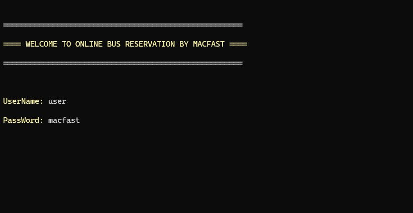
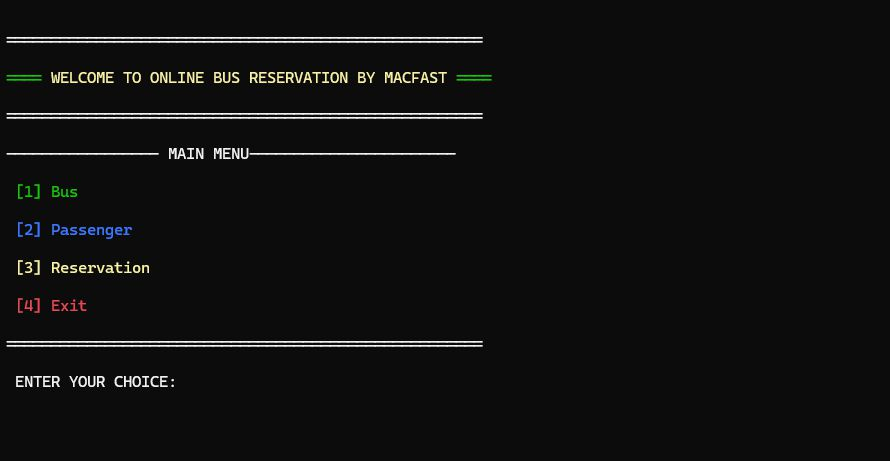
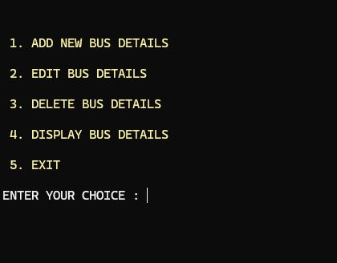
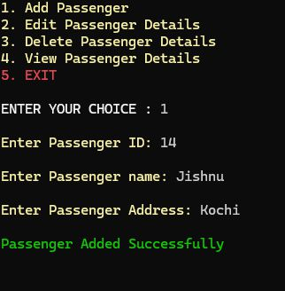
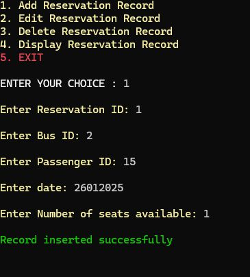

# Bus Reservation System

Welcome to the **Bus Reservation System**! This is a console-based application written in C that allows users to manage buses, passengers, and reservations. The system provides functionalities for adding, editing, deleting, and displaying records for buses, passengers, and reservations.

---

## Features

### 1. **Bus Management**
   - **Add Bus Details**: Add new bus records with details like Bus ID, Name, From, To, Seats, and Fare.
   - **Edit Bus Details**: Modify existing bus records.
   - **Delete Bus Details**: Remove bus records from the system.
   - **Display Bus Details**: View all available bus records.

### 2. **Passenger Management**
   - **Add Passenger Details**: Add new passenger records with details like Passenger ID, Name, and Address.
   - **Edit Passenger Details**: Modify existing passenger records.
   - **Delete Passenger Details**: Remove passenger records from the system.
   - **Display Passenger Details**: View all passenger records.

### 3. **Reservation Management**
   - **Add Reservation**: Book seats for passengers on a specific bus.
   - **Edit Reservation**: Modify existing reservation details.
   - **Delete Reservation**: Cancel a reservation.
   - **Display Reservation**: View all reservation records.

### 4. **User Authentication**
   - A simple login system is implemented to secure access to the application.

---

## Code Structure

The code is organized into the following sections:

1. **Main Menu**:
   - Provides options to manage buses, passengers, and reservations.
   - Exits the application when selected.

2. **Bus Management**:
   - Functions: `busadd()`, `busedit()`, `busdel()`, `busdisplay()`.

3. **Passenger Management**:
   - Functions: `padd()`, `pedit()`, `pdel()`, `pdisplay()`.

4. **Reservation Management**:
   - Functions: `radd()`, `redit()`, `rdelete()`, `rdisplay()`.

5. **File Handling**:
   - Data is stored in text files (`bus.txt`, `pass.txt`, `reserve.txt`).
   - Temporary files are used for updating and deleting records.

6. **Colorful Text**:
   - The `printColoredText()` function is used to display colored text in the console for better user experience.

---

## How to Use

1. **Clone the Repository**:
   ```bash
   git clone https://github.com/yourusername/bus-reservation-system.git
   ```

2. **Compile the Code**:
   Use a C compiler (e.g., `gcc`) to compile the code:
   ```bash
   gcc main.c -o bus_reservation_system
   ```

3. **Run the Program**:
   Execute the compiled program:
   ```bash
   ./bus_reservation_system
   ```

4. **Login**:
   - Use the default credentials:
     - Username: `user`
     - Password: `macfast`

5. **Navigate the Menu**:
   - Use the main menu to manage buses, passengers, and reservations.

---

## Screenshots

Here are some screenshots of the system in action:

1. **Login Screen**  
   

2. **Main Menu**  
   

3. **Bus Management**  
   

4. **Passenger Management**  
   

5. **Reservation Management**  
   

---

## Code Explanation

### Key Functions

1. **`printColoredText()`**:
   - Displays colored text in the console using ANSI escape codes.
   - Example:
     ```c
     printColoredText("Hello, World!", "\033[1;31m"); // Red text
     ```

2. **`login()`**:
   - Authenticates the user with a username and password.

3. **File Handling**:
   - Data is stored in text files (`bus.txt`, `pass.txt`, `reserve.txt`).
   - Temporary files are used for updating and deleting records.

4. **Error Handling**:
   - Checks for file opening errors and invalid user inputs.

---

## Future Improvements

1. **Enhanced User Interface**:
   - Implement a graphical user interface (GUI) for better user experience.

2. **Database Integration**:
   - Replace file handling with a database (e.g., SQLite) for efficient data management.

3. **Advanced Features**:
   - Add features like seat selection, payment integration, and email notifications.

4. **Input Validation**:
   - Improve input validation to handle invalid data gracefully.

---

## License

This project is licensed under the MIT License. See the [LICENSE](LICENSE) file for details.

---

## Contact

For any questions or suggestions, feel free to reach out:

- **GitHub**: [jissjames322](https://github.com/jissjames322)
- **Email**: jissjames322@gmail.com

---

Thank you for using the **Bus Reservation System**! We hope you find it useful and easy to use. Happy coding! 🚌💻
